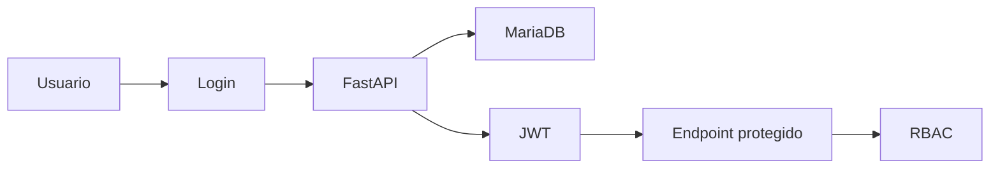

# Autenticación y seguridad

El login valida Argon2id y emite JWT Bearer HS256 con expiración de 30 minutos. Cada endpoint protegido vuelve a comprobar que el usuario está activo y aplica RBAC. CORS se limita al origen configurado; secretos solo se guardan en `.env`.

