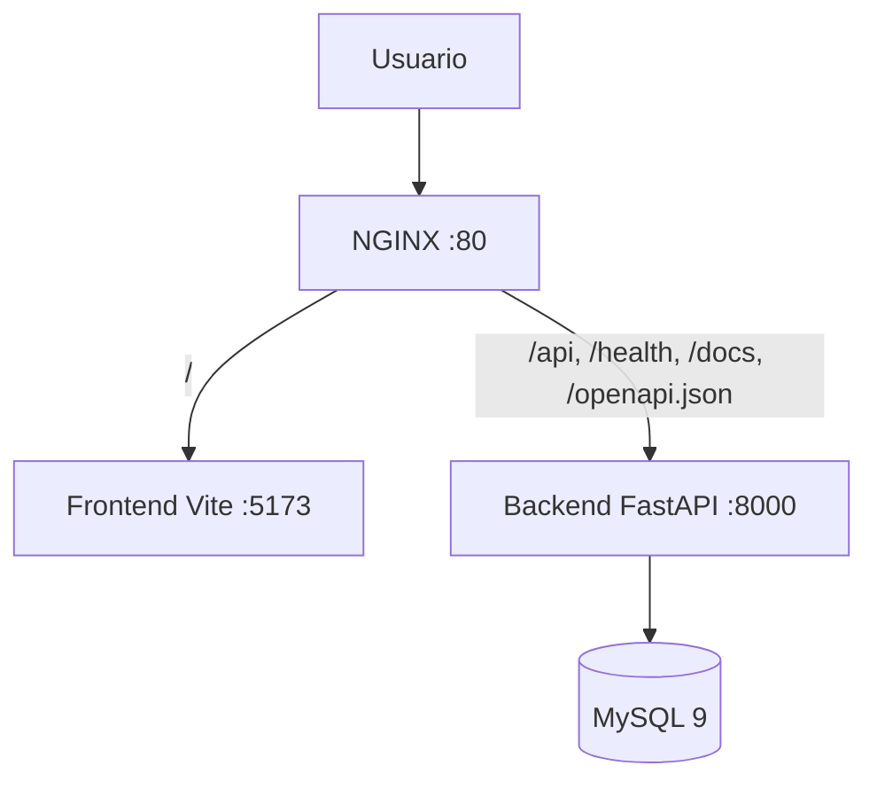

# Fase 16: NGINX como reverse proxy local

La Fase 16 agrega un punto de entrada único y demostrable en `http://localhost`. NGINX vive exclusivamente en Docker Compose local y no modifica Railway, Netlify, S3 ni la configuración de producción.



## Enrutamiento

- `/`: frontend React servido por Vite.
- `/api/`: conserva la ruta completa y la envía a FastAPI; por ejemplo, `/api/v1/vehicles`.
- `/health`: healthcheck de FastAPI.
- `/docs`: Swagger UI.
- `/openapi.json`: esquema OpenAPI utilizado por Swagger.

NGINX reenvía `Host`, IP real, cadena de proxies y protocolo original. El frontend mantiene soporte de upgrade para la conexión de desarrollo de Vite. MySQL permanece accesible solamente dentro de `sigeflot-network`.

## Ejecución

```powershell
docker compose --env-file .env.docker config --quiet
docker compose --env-file .env.docker up -d --build
docker compose --env-file .env.docker ps
docker compose --env-file .env.docker logs nginx --tail 50
```

URLs de demostración:

- `http://localhost/`
- `http://localhost/health`
- `http://localhost/docs`
- `http://localhost/openapi.json`
- `http://localhost/api/v1/vehicles` — requiere JWT y confirma que la ruta llega al backend.

## Alcance actual

Existe una sola instancia de backend, por lo que el bloque `upstream` actúa como abstracción de proxy y no distribuye carga entre réplicas. La evolución prevista es ejecutar varias réplicas y balancearlas mediante Services e Ingress en Kubernetes.
