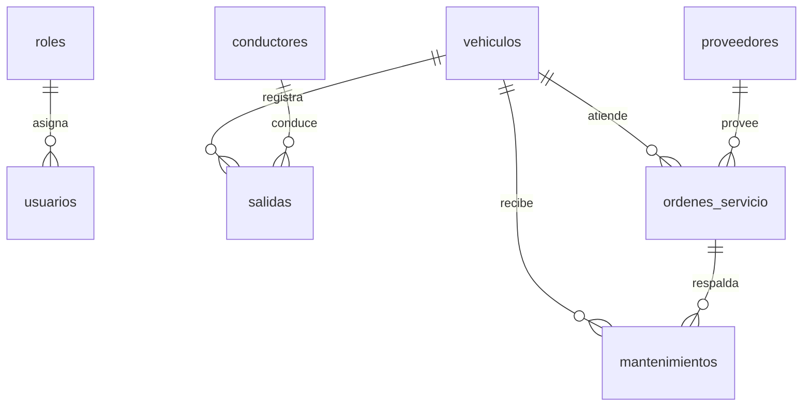

# Modelo de datos

SIGEFLOT usa MariaDB 10.4.32 y SQLAlchemy 2.x. Las tablas conservan PK, FK, índices de correo/placa y restricciones de unicidad y kilometraje; no se usan borrados en cascada para el historial.

